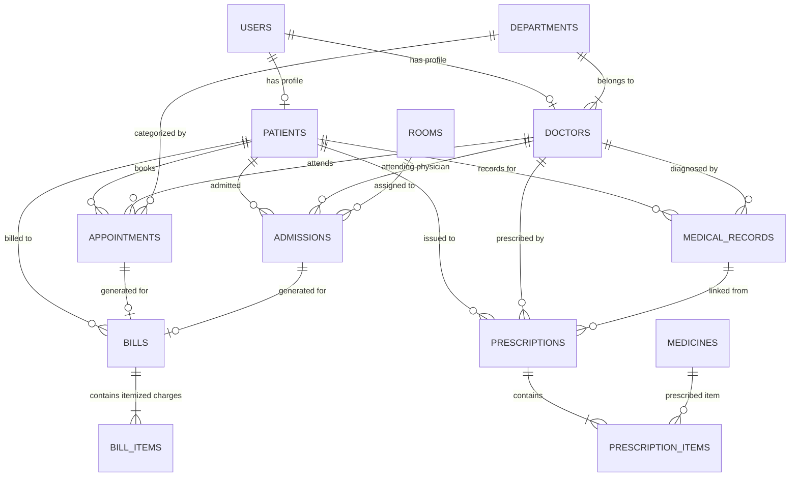

# MediCore HMS — Hospital Management System

> **A Modern, Professional Hospital Management System built with React, Spring Boot, and Supabase PostgreSQL.**


---

## 📋 Table of Contents

1. [Project Overview](#-project-overview)
2. [Key Features](#-key-features)
3. [Technology Stack](#-technology-stack)
4. [System Architecture](#-system-architecture)
5. [Database Architecture & ER Diagram](#-database-architecture--er-diagram)
6. [User Roles & Access Matrix](#-user-roles--access-matrix)
7. [Installation & Setup](#-installation--setup)
   - [Prerequisites](#prerequisites)
   - [1. Oracle Database Setup](#1-oracle-database-setup)
   - [2. Spring Boot Backend Setup](#2-spring-boot-backend-setup)
   - [3. React Frontend Setup](#3-react-frontend-setup)
8. [Sample Login Credentials](#-sample-login-credentials)
9. [REST API Documentation](#-rest-api-documentation)
10. [Key Oracle SQL Features Demonstrated](#-key-oracle-sql-features-demonstrated)
11. [Printing Prescriptions & Invoices](#-printing-prescriptions--invoices)
12. [Troubleshooting & FAQ](#-troubleshooting--faq)

---

## 🏥 Project Overview

**MediCore HMS** is a complete, enterprise-grade Hospital Management System designed as an advanced DBMS application project. Built with strict relational integrity, **Supabase PostgreSQL 17**, a robust layered **Spring Boot** backend, and a modern **React + TypeScript + shadcn/ui** frontend, it delivers a clean, responsive, and trustworthy experience for healthcare professionals, patients, and administrators.

---

## ✨ Key Features

### 👑 Admin Management
- **Central Dashboard**: Real-time stats, revenue trends, appointment charts, department breakdown, room occupancy.
- **Patient Management**: Full CRUD, search, filter by blood group/gender, demographic and emergency contact records.
- **Doctor Management**: Assign departments, specializations, qualifications, experience, and manage active statuses.
- **Department Management**: Organize hospital wings, medical specialties, contact numbers, and doctor allocations.
- **Room & Ward Management**: General Ward, Semi-Private, Private, ICU, and Emergency room allocation with interactive visual status grid.
- **Inpatient Admissions**: Admit patients with real-time room availability validation; 1-click discharge with automatic room status release.
- **Pharmacy & Medicine Inventory**: Track medicine stock, unit pricing, reorder levels, automatic alerts for low-stock and expiring medicines.
- **Billing & Revenue System**: Comprehensive bill generation with breakdown (consultation, room charges, pharmacy, taxes, discounts) and multi-channel payment processing (Cash, Card, UPI, Insurance).
- **Hospital Analytics & Reports**: Tabbed report engine visualizing patient registrations, appointment completion rates, and monthly revenue.

### 🩺 Doctor Portal
- **Doctor Dashboard**: Today's appointment schedule, upcoming consultations, and quick action shortcuts.
- **Patient History & Records**: Browse past diagnoses, symptoms, treatments, and clinical notes.
- **Prescription Builder**: Dynamic multi-item prescription generation with medicine selection, dosages, frequencies, durations, and instructions.
- **Printable Rx**: Browser print-ready prescription format with hospital header and doctor sign-off.
- **Appointment Status**: Update statuses directly (Confirmed, Completed, Cancelled, No Show).

### 🧑‍💼 Patient Portal
- **Patient Dashboard**: View upcoming appointments, personal medical records, recent bills, and active prescriptions.
- **Book Appointments**: Schedule consultations with doctors across departments with server-side conflict detection.
- **Medical Records Timeline**: Interactive chronological view of clinical notes and past diagnoses.
- **Prescription & Invoices**: View itemized invoices and prescriptions with 1-click browser printing/PDF saving.

---

## 🛠️ Technology Stack

| Layer | Technologies |
|---|---|
| **Frontend** | React 18, TypeScript, Vite, Tailwind CSS, shadcn/ui (Radix UI), Lucide React, Recharts, React Router v6, Axios, React Hook Form, Zod |
| **Backend** | Java 17+, Spring Boot 3.2, Spring Data JPA, Hibernate, Spring Security 6, JWT (io.jsonwebtoken), Bean Validation, Lombok |
| **Database** | **Supabase PostgreSQL 17**, PostgreSQL JDBC Driver (`org.postgresql:postgresql`), SQL & PL/pgSQL |

---

## 🏗️ System Architecture

```text
React 18 Frontend (Vite + TypeScript)
       │
       │ HTTP / REST API (JSON) + JWT Authorization Bearer Tokens
       ▼
Spring Boot 3.2 Backend
 ├── Controllers       (REST API Endpoints & Request Validation)
 ├── Security / JWT    (Authentication Filter, Token Provider, UserDetailsService)
 ├── Services          (Business Logic, Transaction Management, Conflict Checking)
 ├── Repositories      (Spring Data JPA Data Access Layer)
 └── Entities          (JPA Model Mappings with PostgreSQL Sequence Generators)
       │
       │ PostgreSQL JDBC (org.postgresql) via Session Pooler (port 5432, SSL)
       ▼
Supabase PostgreSQL Database (13 Tables, Sequences, Triggers, Views, Functions)
```

---

## 📊 Database Architecture & ER Diagram

The database strictly complies with **Third Normal Form (3NF)**.



---

## 🔐 User Roles & Access Matrix

| Feature / Module | ADMIN | DOCTOR | PATIENT |
|---|:---:|:---:|:---:|
| View Admin Dashboard & Analytics | ✅ | ❌ | ❌ |
| Doctor / Patient Dashboards | ❌ | ✅ | ✅ |
| Manage Patients (CRUD) | ✅ | View Only | View Own Profile |
| Manage Doctors (CRUD) | ✅ | View Only | View Only |
| Manage Departments | ✅ | View Only | View Only |
| Manage Appointments | ✅ Full | ✅ View/Update Assigned | ✅ Book/Cancel Own |
| Admit / Discharge Inpatients | ✅ | View Only | View Own |
| Manage Rooms & Wards | ✅ | View Only | ❌ |
| Add / View Medical Records | ✅ Full | ✅ Create & View | ✅ View Own Only |
| Pharmacy & Medicine Stock | ✅ Full | View Only | ❌ |
| Prescriptions | ✅ Full | ✅ Create & View | ✅ View/Print Own |
| Invoices & Billing | ✅ Full | ❌ | ✅ View/Print Own |
| Reports & Analytics | ✅ Full | ❌ | ❌ |

---

## 🚀 Installation & Setup

### Prerequisites
- **Java JDK 17** or higher
- **Node.js 18+** & `npm`
- **Supabase Account / Project** (or local PostgreSQL 15+)
- **Maven 3.9+**

---

### 1. Supabase PostgreSQL Database Setup

1. Log in to your **Supabase Dashboard** and open your project.
2. Go to the **SQL Editor** (`/project/<project-ref>/editor`).
3. Open `database/postgresql/setup_all.sql` from this repository.
4. Paste the script contents into the Supabase SQL Editor and click **Run**.
   - This executes all 13 table definitions, native sequences, unique conflict constraints, relational views, PL/pgSQL audit & room triggers, stored procedures/functions, and the 3 canonical demo accounts with realistic seed data.
   - It also synchronizes all 13 sequence counters with the seeded data.

*(Legacy Oracle XE SQL scripts are preserved under `database/oracle/` for historical reference).*

---

### 2. Spring Boot Backend Setup

1. Navigate to the backend directory:
   ```bash
   cd backend
   ```
2. Set your environment variables (or configure `src/main/resources/application.yml`):
   ```bash
   export DATABASE_URL="jdbc:postgresql://<host>:5432/postgres?sslmode=require"
   export DATABASE_USERNAME="postgres.<project-ref>"
   export DATABASE_PASSWORD="<your-supabase-password>"
   ```
3. Run the Spring Boot application:
   ```bash
   mvn spring-boot:run
   ```
   *Health endpoint available at `http://localhost:8081/api/health`.*

---

### 3. React Frontend Setup

1. Navigate to the frontend directory:
   ```bash
   cd frontend
   ```
2. Install dependencies:
   ```bash
   npm install
   ```
3. Start the Vite development server:
   ```bash
   npm run dev
   ```
4. Open your browser at `http://localhost:5173`.

---

## 🔑 Canonical Demo Credentials

The system contains **exactly three canonical demo accounts** — one for each role. All three use the password: `Demo@123`

| Role | Username | Password | Full Name & Profile |
|---|---|---|---|
| **Admin** | `demo.admin` | `Demo@123` | System Administrator (Full Command Console & Analytics) |
| **Doctor** | `demo.doctor` | `Demo@123` | Dr. Rajesh Kumar (Interventional Cardiology) |
| **Patient** | `demo.patient` | `Demo@123` | Amit Sharma (Confidential Health Portal, Rx, Statements) |

> 💡 **Public Registration ("Create Account")**: New users can register for their own personalized patient account on the Login page. Public registration creates permanent, sequence-generated `USERS` and `PATIENTS` rows in Supabase PostgreSQL.

---

## ☁️ Railway Cloud Production Deployment

### Architecture Overview

```text
  React Frontend (Railway / Nginx Container)
                  │
                  ▼ (HTTPS / REST API)
  Spring Boot 3.2 Backend (Railway Container)
                  │
                  ▼ (PostgreSQL JDBC via Session Pooler :5432, SSL)
  Supabase Cloud PostgreSQL Database
```

### 1. Backend Service (`medicore-backend`)

- **Root Directory**: `/backend`
- **Builder**: `DOCKERFILE` (uses `backend/Dockerfile`)
- **Environment Variables**:
  | Variable | Description | Example / Recommended Value |
  |---|---|---|
  | `DATABASE_URL` | Supabase Session Pooler JDBC URL | `jdbc:postgresql://aws-0-ap-south-1.pooler.supabase.com:5432/postgres?sslmode=require` |
  | `DATABASE_USERNAME` | Supabase Pooler Username | `postgres.<project-ref>` |
  | `DATABASE_PASSWORD` | Supabase Database Password | `<your-database-password>` |
  | `JWT_SECRET` | 256-bit secret key for signing JWTs | `<secure-random-string>` |
  | `CORS_ALLOWED_ORIGINS` | Allowed frontend URLs | `http://localhost:5173,https://<frontend-domain>.up.railway.app` |

### 2. Frontend Service (`medicore-frontend`)

- **Root Directory**: `/frontend`
- **Builder**: `DOCKERFILE` (uses `frontend/Dockerfile` + `nginx.conf`)
- **Environment Variables / Build Args**:
  | Variable | Description | Example |
  |---|---|---|
  | `VITE_API_BASE_URL` | Public URL of deployed Spring Boot backend | `https://<backend-domain>.up.railway.app/api` |

### Railway Deployment Files Included
- `backend/Dockerfile`: Multi-stage build with Eclipse Temurin JDK 17 and unprivileged `medicore` user.
- `backend/Procfile` & `backend/railway.json`: Web runner binding to Railway dynamic `$PORT`.
- `frontend/Dockerfile` & `frontend/nginx.conf`: Nginx Alpine container with dynamic `$PORT` binding and SPA client routing.
- Health Check: `GET /api/health` probes backend status and Supabase PostgreSQL connectivity.


---

## 📡 REST API Documentation

### Authentication (`/api/auth`)
- `POST /api/auth/login` — Authenticate user and receive JWT bearer token

### Patients (`/api/patients`)
- `GET /api/patients` — List patients (supports `?search=` and `?bloodGroup=`)
- `GET /api/patients/{id}` — Get patient profile by ID
- `POST /api/patients` — Create patient and automatically provision user account
- `PUT /api/patients/{id}` — Update patient details
- `DELETE /api/patients/{id}` — Delete patient record

### Doctors (`/api/doctors`)
- `GET /api/doctors` — List doctors with department details
- `GET /api/doctors/{id}` — Get doctor details
- `POST /api/doctors` — Add new doctor
- `PUT /api/doctors/{id}` — Update doctor profile
- `DELETE /api/doctors/{id}` — Delete doctor

### Appointments (`/api/appointments`)
- `GET /api/appointments` — List appointments
- `GET /api/appointments/{id}` — Get appointment details
- `POST /api/appointments` — Schedule appointment (validates doctor schedule conflicts)
- `PUT /api/appointments/{id}/status` — Transition status (`Scheduled`, `Confirmed`, `Completed`, `Cancelled`, `No Show`)
- `DELETE /api/appointments/{id}` — Delete appointment

### Admissions & Rooms (`/api/admissions`, `/api/rooms`)
- `GET /api/rooms` — List all hospital rooms with occupancy states
- `POST /api/rooms` — Create room
- `GET /api/admissions` — List all inpatient admissions
- `POST /api/admissions` — Admit patient (checks availability and sets room to `Occupied`)
- `PUT /api/admissions/{id}/discharge` — Discharge patient (sets discharge timestamp and resets room to `Available`)

### Pharmacy & Prescriptions (`/api/medicines`, `/api/prescriptions`)
- `GET /api/medicines` — List medicines
- `GET /api/medicines/low-stock` — List medicines at or below reorder level
- `GET /api/medicines/expiring` — List medicines expiring within 90 days
- `GET /api/prescriptions` — List prescriptions
- `POST /api/prescriptions` — Create multi-item prescription

### Invoicing & Billing (`/api/bills`)
- `GET /api/bills` — List bills
- `GET /api/bills/{id}` — Get invoice details
- `POST /api/bills` — Generate bill (server-side total computation)
- `PUT /api/bills/{id}/payment` — Record payment (`Cash`, `Card`, `UPI`, `Insurance`)

### Reports & Analytics (`/api/reports`)
- `GET /api/reports/dashboard/admin` — Key dashboard KPIs
- `GET /api/reports/dashboard/doctor` — Doctor-specific metrics
- `GET /api/reports/dashboard/patient` — Patient-specific metrics
- `GET /api/reports/appointments/stats` — Appointment distribution
- `GET /api/reports/revenue/monthly` — 6-month revenue history
- `GET /api/reports/patients/monthly` — 6-month patient registration velocity

---

## 💡 Key Database & SQL Features Demonstrated

1. **Sequences**: 13 native PostgreSQL sequences (`patient_seq`, `doctor_seq`, `appointment_seq`, etc.).
2. **Triggers & PL/pgSQL Functions**:
   - `trg_room_occupy`: Automatically marks room `Occupied` upon patient admission.
   - `trg_room_release`: Automatically marks room `Available` upon patient discharge.
   - `update_timestamp()` trigger: Maintains audit timestamp on update across all 13 tables.
3. **Stored Procedures & Functions**:
   - `sp_admit_patient`: Transactional admission with room verification and occupancy locking.
   - `sp_discharge_patient`: Transactional discharge with room release.
   - `fn_calculate_room_charges`: Computes bed charges based on stay duration.
   - `fn_calculate_bill_total`: Financial total aggregator.
4. **Relational Views**:
   - `v_patient_appointments`: Consolidated appointment details with doctor & department names.
   - `v_room_status`: Live room occupancy view with current inpatient details.
   - `v_bill_summary`: Comprehensive billing and payment tracking.
   - `v_medicine_stock_alert`: Stock threshold and expiry risk warnings.
   - `v_doctor_schedule`: Active and future consultations for practitioners.
   - `v_department_statistics`: Department-level appointment volume and status analytics.

---

## 🖨️ Printing Prescriptions & Invoices

Both the **Prescription Detail** (`/prescriptions/:id`) and **Invoice View** (`/billing/:id`) include clean, browser-ready print styles:
- Click the **"Print"** or **"Save as PDF"** button on the interface.
- CSS `@media print` rules automatically hide sidebars, navigation buttons, and unnecessary margins.
- A clean, professional letterhead with hospital branding and signature blocks will render in the print preview.

---

## ❓ Troubleshooting & FAQ

- **Supabase Connection Errors**: Ensure you connect via the **Session Pooler** (`aws-0-*.pooler.supabase.com:5432`) and that username is formatted as `postgres.<project-ref>`. SSL must be set to `sslmode=require`.
- **CORS Configuration**: Provide all allowed origins in `CORS_ALLOWED_ORIGINS` (e.g. `http://localhost:5173,https://your-frontend.railway.app`).
- **JWT Expired**: Log out and log in again with any of the demo accounts listed above.

---

*MediCore HMS — Built for Academic Excellence in Database Management Systems.*
